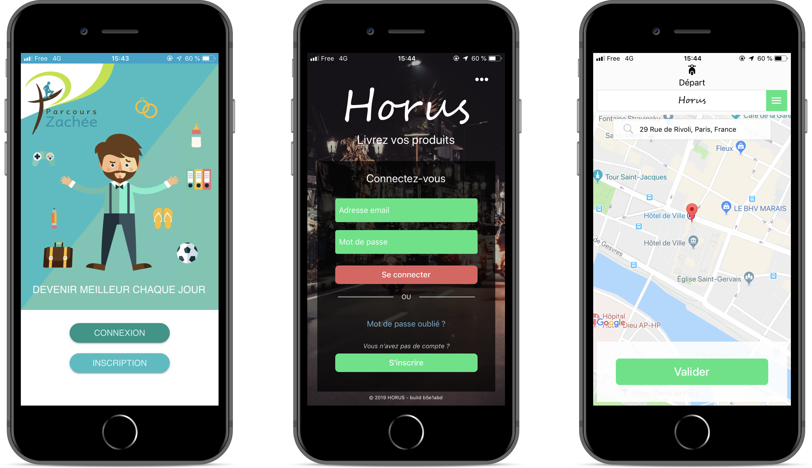
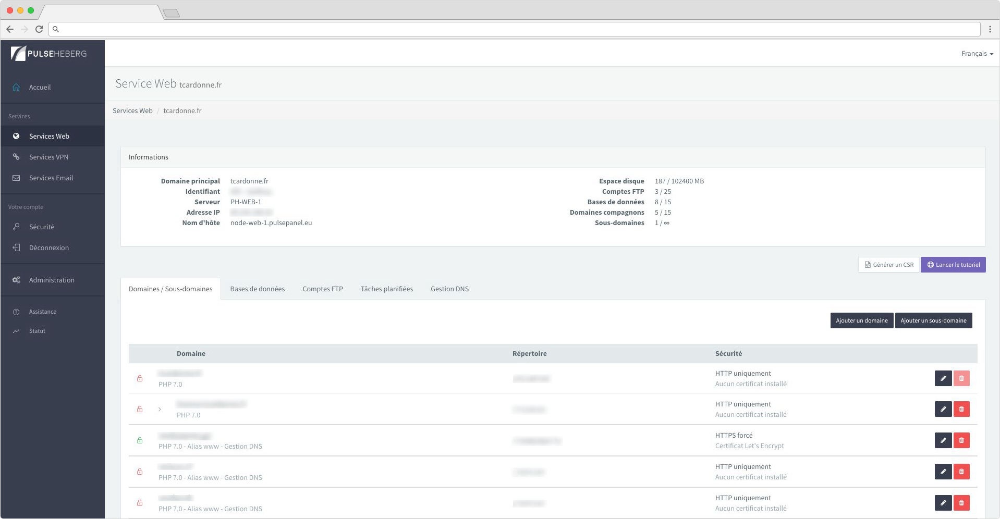
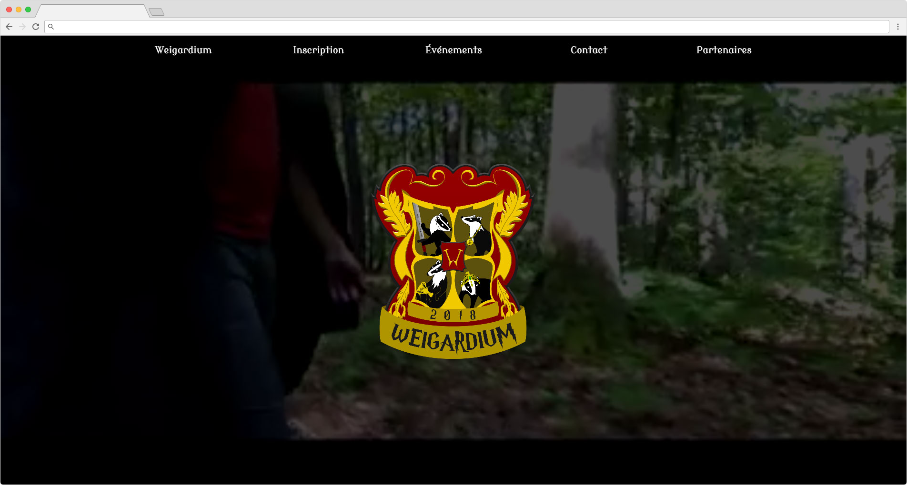
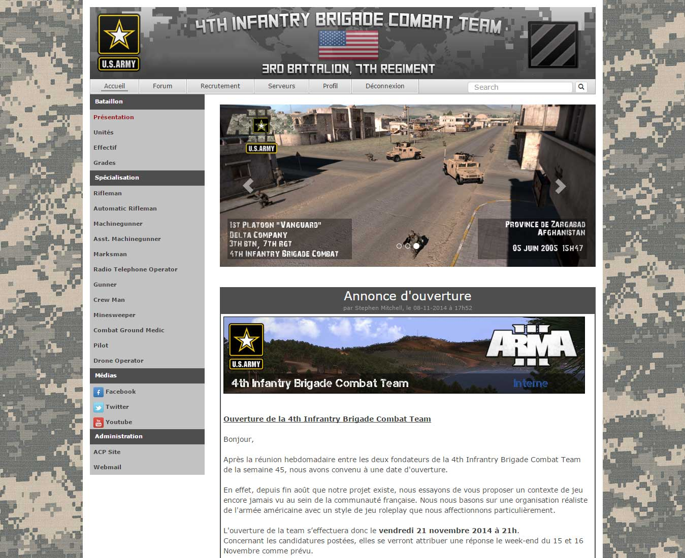
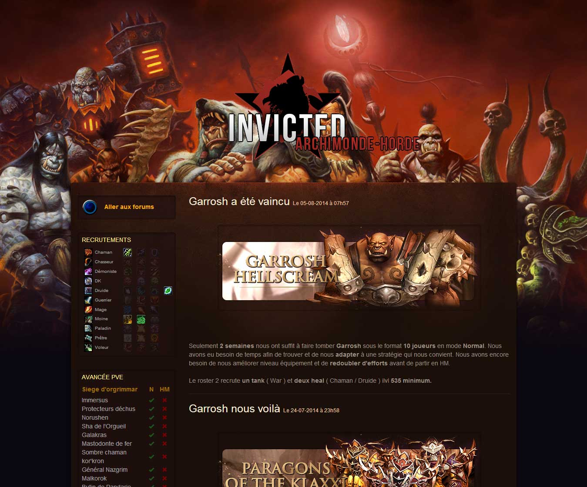
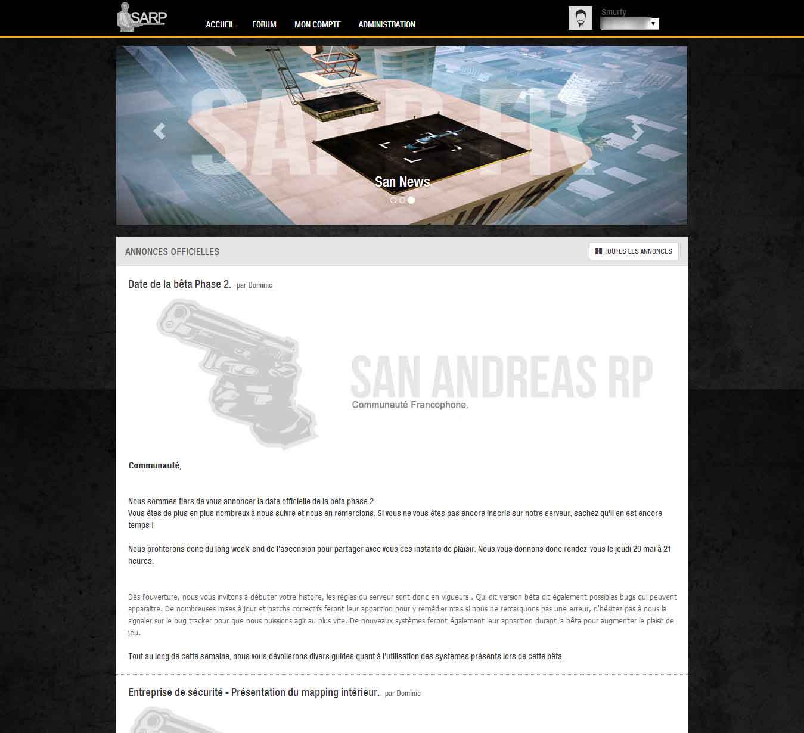
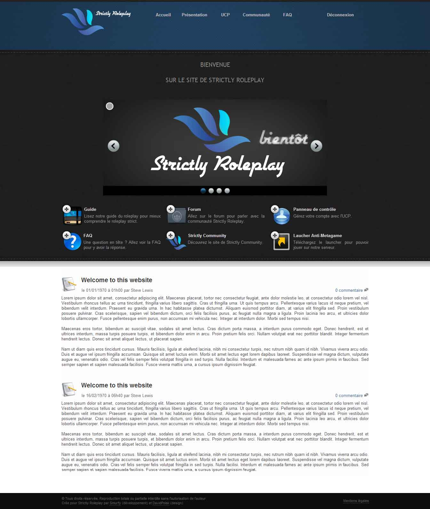
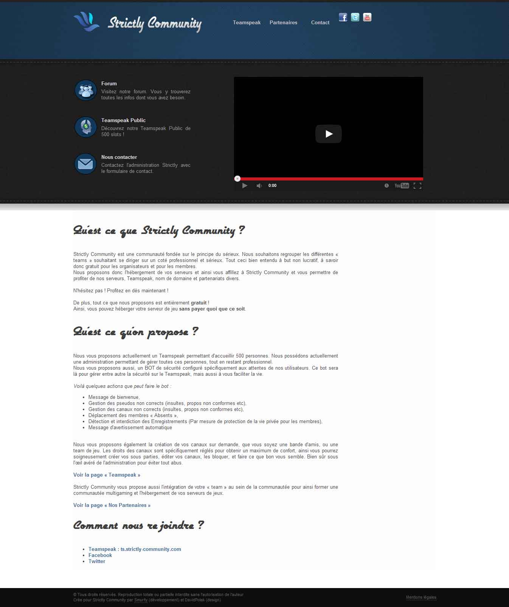

# My Portfolio

This is a repository where I list old projects I worked on.
I found convenient to use a repository for this purpose as I wanted to keep my [personal landing page](https://tcardonne.fr) as light as possible.

_Disclaimer : Although it's a personal listing, some projects were developed with other persons (developers, designers...)._

## Table of contents

* [Junior Enterprise SEPEFREI](#Junior-Enterprise-SEPEFREI)
* [PulseHeberg](#pulseheberg)
* [WEI EFREI](#wei-efrei)

## Junior Enterprise SEPEFREI

`2017-2019`
`Symfony 4`, `React Native`, `AngularJS`, `Cordova`, `WordPress`, `Docker`

I joined the Efrei Paris' Junior Enterprise in 2017 as a developer. I've worked on multiple projects for external customers.
During these projects, I've learnt how to build cross-platform mobile applications using frameworks like React-Native and Cordova.

## PulseHeberg

`2014-2018`
`Symfony 3`, `AngularJS`, `System administration`, `Networking`

I helped to create a centralized management interface for the hosting provider [pulseheberg.com](https://pulseheberg.com).
This interface enables customers to manage their services (web hosting, emails, VPN) in a central place.
The web hosting solution was fully developped by our team : from the development of the API to the underlying infrastructure.

## WEI EFREI

`2016,2018`
`Symfony 3`, `Docker`

I've participated, in 2016 and 2018, in the organization of the Integration Weekend, which gathers around 800 persons every year. In order to get rid of paper applications, I've created a website to handle all registrations for this event (ie: collect personal and security related informations).

## Other freelance and personal projects

Following projects are some (very) old projects I've made. Most of them are related to gaming teams and servers.

### 4th-ibct.com / 82nd-airborne.com

`2014`
`Symfony 2`, `WordPress`

### guilde-invicted.fr

`2014`
`Symfony 2`

### SA-RP.fr

`2014`
`Symfony 2`

### NG Volley Ball

`2014`
`Symfony 2`

### LS Police Department

`2013`
`Symfony 2`

### Universal Multigaming

`2012`
`Symfony 2`

### Strictly Community / Strictly Roleplay

`2012`
`PHP`